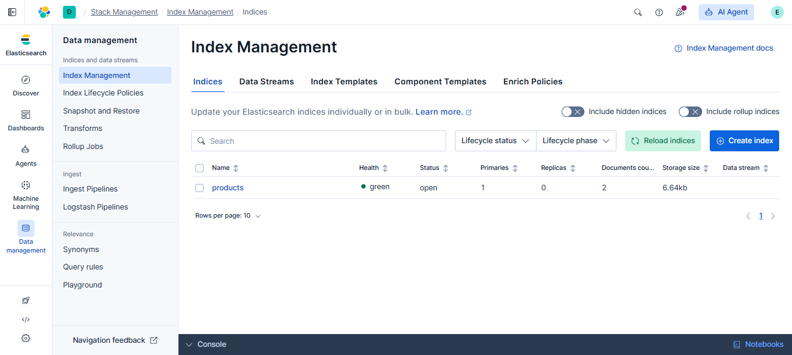

# elastic-search-in-django

## Prerequisites

Before running this project, ensure that Elasticsearch is running on your local machine. If Elasticsearch is not already installed and running, follow the setup instructions below.

## Installation and Setup

Visit the [Elasticsearch Downloads](https://www.elastic.co/downloads/elasticsearch) or [Elasticsearch pypi](https://pypi.org/project/elasticsearch/) page to get started. There are two methods to run Elasticsearch:

### Method 1: Using Docker (Recommended)

If Docker is installed on your machine, run the following command in your terminal:

```bash
curl -fsSL https://elastic.co/start-local | sh
```

Once the container is running, verify the installation by visiting:
- Elasticsearch API: [http://localhost:9200/](http://localhost:9200/)
- Kibana UI: [http://localhost:5601/](http://localhost:5601/)

### Method 2: Manual Installation

1. Download the Elasticsearch ZIP file and extract it to your desired location
2. Navigate to the `config` folder and open `elasticsearch.yml` in a text editor
3. Add the following line at the end of the file:
   ```
   xpack.security.enabled: false
   ```
4. Save the file and close the editor
5. Navigate to the `bin` folder, open a terminal, and run:
   ```bash
   elasticsearch.bat
   ```
6. Verify the installation by visiting [http://localhost:9200/](http://localhost:9200/)

## Data Indexing

To manage data in Elasticsearch, use the following Django management commands:

```bash
# Create a new index
python manage.py search_index --create

# Populate the index with existing data
python manage.py search_index --populate

# Delete the index
python manage.py search_index --delete

# Rebuild the index (delete and recreate)
python manage.py search_index --rebuild
```

## Elasticsearch API

Retrieve indexed data through the Elasticsearch API:

```
GET http://localhost:9200/products/_search?q=%22product%22
```

**Sample API Response:**
```json
{
  "_shards": {
    "total": 1,
    "successful": 1,
    "skipped": 0,
    "failed": 0
  },
  "hits": {
    "total": {
      "value": 2,
      "relation": "eq"
    },
    "max_score": 0.19856803,
    "hits": [
      {
        "_index": "products",
        "_id": "1",
        "_score": 0.19856803,
        "_source": {
          "brand": {
            "name": "Brand two",
            "description": "brand description two"
          },
          "title": "Product 1",
          "description": "Product description",
          "category": "cat 1",
          "price": 100,
          "sku": "brand-one-product-one",
          "thumbnail": "https://www.facebook.com"
        }
      },
      {
        "_index": "products",
        "_id": "2",
        "_score": 0.18232156,
        "_source": {
          "brand": {
            "name": "Brand one",
            "description": "brand description"
          }
        }
      }
    ]
  }
}
```

## Kibana Dashboard & Data Visualization

Access Kibana at [http://localhost:5601/](http://localhost:5601/) to visualize and manage your Elasticsearch indices.


